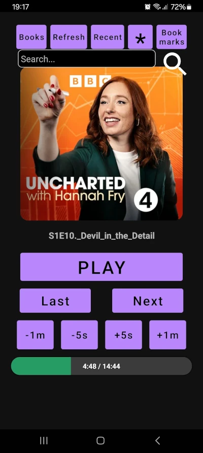

# Android Audio Book App (vibe coded)

## Notes

My first substantial vibe coded Android App, using ChatGPT and Claude AI.

Coded on Linux Ubuntu 22.04 LTS (no Android Studio) using:  
`openjdk-17-jdk` (Java Dev Kit)  
`gradle-8.9-bin` (Gradle)  
`commandlinetools-linux-11076708_latest` (Android SDK Command-Line Tools)

The objective was to build an audio book app (plays local audio files) that has a recents view that has the ability to remove unwanted books, and a quick add bookmarks button (timestamp) that avoids having to name the bookmarks. Bookmarks belonging to any given audio book can be viewed via the Mookmarks button.

### Advantages

* No unwanted updates or functionality.
* UI can be tailored to the individual - large buttons/fonts etc.
* No unwanted adds.
* No scraping user data.

<svg aria-hidden="true" height="16" viewBox="0 0 16 16" version="1.1" width="16" data-view-component="true" class="octicon octicon-package color-fg-muted mr-2">
    <path d="m8.878.392 5.25 3.045c.54.314.872.89.872 1.514v6.098a1.75 1.75 0 0 1-.872 1.514l-5.25 3.045a1.75 1.75 0 0 1-1.756 0l-5.25-3.045A1.75 1.75 0 0 1 1 11.049V4.951c0-.624.332-1.201.872-1.514L7.122.392a1.75 1.75 0 0 1 1.756 0ZM7.875 1.69l-4.63 2.685L8 7.133l4.755-2.758-4.63-2.685a.248.248 0 0 0-.25 0ZM2.5 5.677v5.372c0 .09.047.171.125.216l4.625 2.683V8.432Zm6.25 8.271 4.625-2.683a.25.25 0 0 0 .125-.216V5.677L8.75 8.432Z"></path>
</svg>
<a href="download/audioapp.apk">audioapp.apk</a>

## Main View

## Select View

## Recents View

## Bookmarks View
